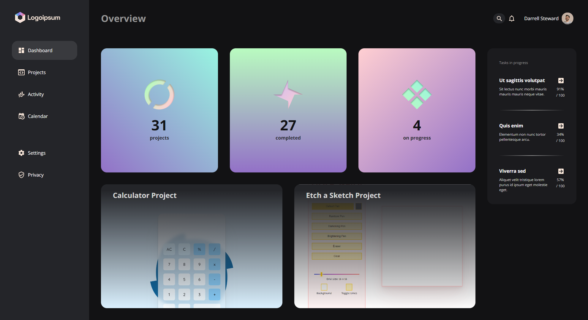

# Odin-Admin-Dashboard

[Live link is here.](https://x6nenko.github.io/Odin-Admin-Dashboard/)

## Project tasks.
- [x] Use a grid to recreate the layout.

## Extra features. They are not required by a project. That's my list of optional ideas and tasks to make it better.

### Extra features that were implemented:
- [x] Style search input. With a click or focus it expands from just icon to input field, so user can type the search request. Made it only with CSS by combining label and pointer-events.
- [x] Optimised the lighthouse to show 4x 100.

### Extra features and tasks to implement:
- [ ] Refactor the code. Make it more clean. DRY.

## What I've learned.
- When I was looking for the solution for my search input I didn't found anywhere the combination I've used of label and pointer-events.
- Practised grid layot.
- Accessibility: Practised using the aria-label and other stuff.